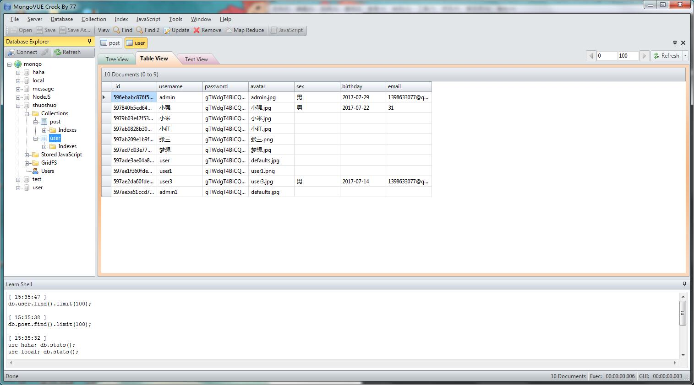
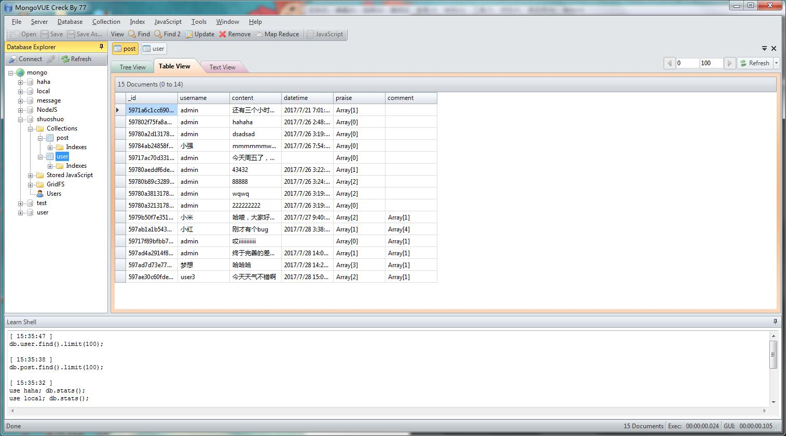
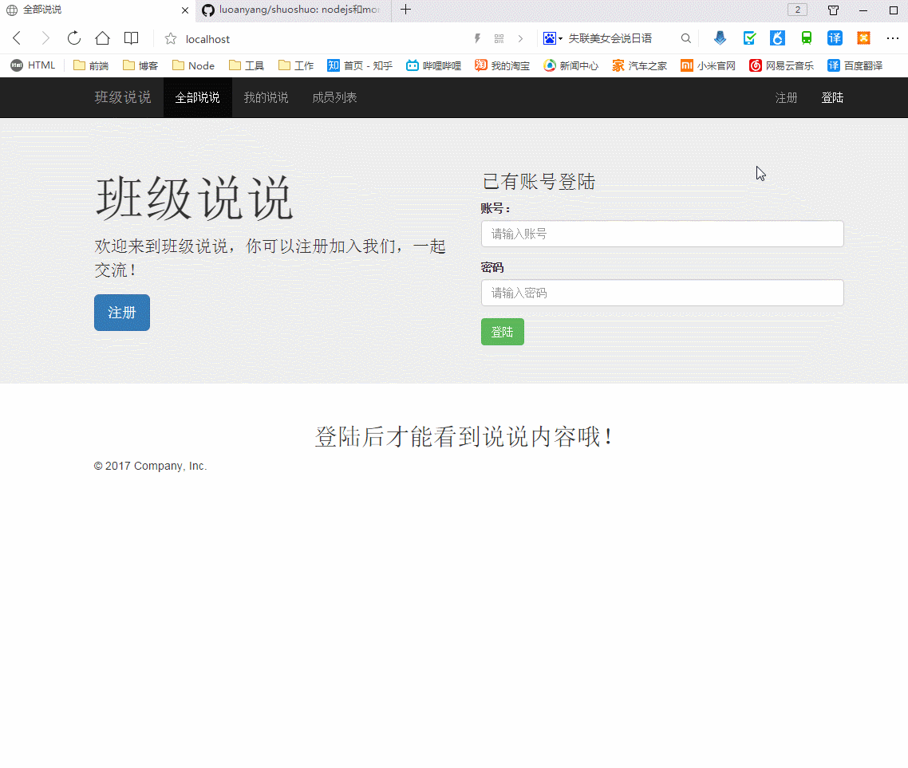

 # 班级说说

### 1.nodejs和mongodb开发的一个班级说说
1. 后端用了express、ejs模版引擎,monogdb,gm(裁剪上传图片)，密码使用md5加密。
2. 前端用了jquery、bootstrsp完成登陆注册页面的功能。
3. 规定了所有说说和我的说说的接口，用vue.js发送请求获取接口数据完成了分页。利用vue.js双向绑定的特性。

### 2.项目结构
|__router     //控制器        
|__models        //模型  
|__public         //静态资源  
|__views          //视图  
|__avatar         //头像存储文件夹
|__app.js         //入口文件  
|__package.json   //依赖   
|__setting.json    //数据库的地址

### 4.数据库结构
1. 用户表

2. 说说表

### 4.项目运行  

1. git clone git@github.com:luoanyang/shuoshuo.git
2. cd shuoshuo
3. npm install
4. mongod --dbpath c:/mongo  //需要开启mongodb
5. node app.js
6. 浏览器打开 localhost (端口为80)

### 5.项目演示

